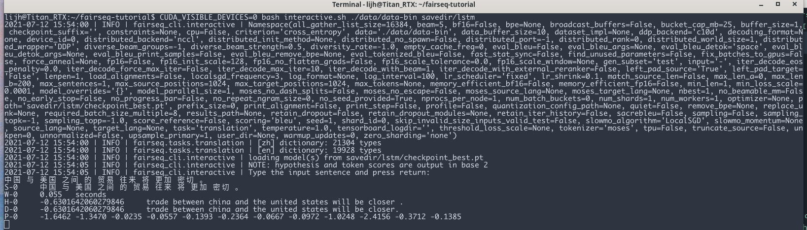

# Fairseq
Fairseq是Facebook出品的、专为序列生成服务的深度学习库。Fairseq中实现了许多先进的序列生成算法，并且代码整洁，封装程度高，拓展性强，故受到了很多研究人员的欢迎。 本篇指南旨在对Fairseq库做一个简单的介绍，以帮助同学们快速熟悉这个强大的代码库，来方便之后进行自然语言生成方向的研究、实践。

## 简单使用
在深入了解Fairseq的代码结构之前，让我们先通过一个简单的示例，来熟悉一下Fairseq的使用流程，对应的数据和代码可以见附带的压缩包。

假设我们现在有一个中英翻译的数据集（见 data/chinese-english），数据集中包含了100000句对应的中英句对以供训练，并分别包含1000句中英句对以供验证和测试。

### 数据预处理
使用Fairseq的第一步是将原始数据预处理成二进制文件存储下来，以方便后续处理的方便。 为此，我们首先需要将原始的句对组织成 xxx.src, xxx.tgt的形式，xxx.src中存储了平行句对的源端句子，xxx.tgt中存储了平行句对的目标端句子，两个文件的每一行是一一对应的(data目录下已经进行了相应的处理)。然后，就可以使用以下指令

``` shell
fairseq-preprocess --source-lang zh --target-lang en --trainpref ./data/chiense-english/train --validpref ./data/chinese-english/valid --testpref ./data/chinese-english/test --destdir ./data/data-bin --workers 20
```
来处理数据，并将结果存放在 `./data/data-bin`下。

### 训练模型
将数据处理完毕之后，我们就可以使用Fairseq所实现的序列到序列算法来训练一个中文到英文的机器翻译模型。训练一个基于LSTM的Seq2Seq模型的命令已经写在了`train_lstm.sh`中，可以通过运行`CUDA_VISIBLE_DEVICES=x bash train_lstm.sh`执行。 让我们看一下`train_lstm.sh`的内容：

``` shell
databin=./data/data-bin
savedir=./savedir/lstm
fairseq-train \
    $databin \
    --arch lstm\
    --optimizer adam --adam-betas '(0.9, 0.98)' \
    --lr 1e-3 \
    --encoder-layers 1 --encoder-bidirectional --decoder-layers 1\
    --dropout 0.1 --weight-decay 0.0001 \
    --criterion label_smoothed_cross_entropy --label-smoothing 0.1\
    --max-tokens 4000\
    --eval-bleu \
    --eval-bleu-args '{"beam": 1, "max_len_a": 1.2, "max_len_b": 20}' \
    --eval-bleu-detok moses --eval-bleu-print-samples\
    --best-checkpoint-metric bleu --maximize-best-checkpoint-metric\
    --no-save-optimizer-state  --no-epoch-checkpoints --patience 10 --save-dir $savedir -s src -t tgt\

```
其中， `--arch`后面跟的`lstm`代表我们想要使用Fairseq中实现的`lstm`这个架构来进行模型的搭建（如果有需要的话，后续也可以自定义架构。） `--optimizer adam`表示我们希望使用Adam优化器来优化我们的模型。 `--encoder-layers 1 --encoder-bidirectional --decoder-layers 1 --dropout 0.1` 为模型的一些超参数, `--criterion label_smoothed_cross_entropy --label-smoothing 0.1` 表示我们希望使用带有Label Smoothing机制的交叉熵损失来作为模型的优化目标。除此之外还有很多参数，同学们可以自己去阅读源码来了解它们的含义。

同理，训练一个基于Transformer的Seq2Seq模型的命令如下:

``` shell
databin=./data/data-bin
savedir=./savedir/transformer
fairseq-train \
    $databin \
    --arch transformer_iwslt_de_en --share-decoder-input-output-embed \
    --optimizer adam --adam-betas '(0.9, 0.98)' --clip-norm 0.1 \
    --lr 5e-4 --lr-scheduler inverse_sqrt --warmup-updates 4000 \
    --dropout 0.1 --weight-decay 0.0001 \
    --criterion label_smoothed_cross_entropy --label-smoothing 0.1 \
    --max-tokens 4000 \
    --eval-bleu --eval-bleu-print-samples\
    --eval-bleu-args '{"beam": 1, "max_len_a": 1.2, "max_len_b": 20}' \
    --eval-bleu-detok moses \
    --best-checkpoint-metric bleu --maximize-best-checkpoint-metric\
    --no-save-optimizer-state --patience 10 --save-dir $savedir -s src -t tgt \
```
与上面类似，同学们可以通过执行`CUDA_VISIBLE_DEVICES=x bash train_transformer.sh`运行。

### 测试训练好的模型
在上一个小节的训练完成后，我们就可以尝试使用训练得到的模型来进行翻译（当然，由于本教程中用来训练模型的平行语料规模相对较小，因此所获得模型的翻译性能可能并不会特别好）。在Fairseq中，进行翻译有两种方式，一种是直接使用`fairseq-generate`命令来翻译之前使用`fairseq-preprocess`命令处理好的数据集，示例的命令如下，可通过运行`CUDA_VISIBLE_DEVICES=x bash generate.sh`来执行:

``` shell
databin=$1
checkpoint_dir=$2
fairseq-generate $databin \
                 --path $checkpoint_dir/checkpoint_best.pt \
                 --batch-size 128 \
                 --beam 5  \
                 --results-path $checkpoint_dir/beam-5 \
                 --scoring sacrebleu \
                 --gen-subset test \
                 --tokenizer moses

tail -1 $checkpoint_dir/beam-5/generate-test.txt

```
上述命令表示我们希望使用`$checkpoint_dir`这个目录下训练得到的`checkpoint_best.pt`这个模型来对`$databin`中的`test`子集进行翻译，翻译时使用的`beam size`为5，`batch-size`为128。 翻译好的结果被存储在了`$checkpoint_dir/beam-5/generate-test.txt`这个文件中。

当然，很多时候我们在处理数据的时候并不知道希望翻译的句子，所以需要在训练完模型之后，给定一个句子时，对其进行实时地翻译，这可以通过以下命令实现，可通过运行`CUDA_VISIBLE_DEVICES=x bash interactive.sh`来执行:

``` shell
databin=$1
checkpoint_dir=$2
result_path=$3
fairseq-interactive $databin \
                 --path $checkpoint_dir/checkpoint_best.pt \
                 --batch-size 128 \
                 --beam $5  \
                 --gen-subset $4 \
                 --remove-bpe --tokenizer moses
```
执行这个命令会进入一个交互式的界面，此时当输入一句待翻译的句子时，程序就能够调用训练好的模型来对其进行翻译，并输出结果。

下图是一个示例:



## 进阶使用
Fairseq基于pytorch开发,因此其训练一个神经网络模型的所需要的元素与普通的代码库类似。 回忆一下，在实现一个神经网络算法时，我们需要定义如下几个组件: (1) 数据 （2）模型 （3）优化目标 （4）优化器 。 在Fairseq中，每一个组件都由一个对应的类封装起来，分别是 `Dataset`, `Model`, `Criterion`, 以及 `Optimizer`。 除此之外，Fairseq中还定义了一个叫做`Task`的概念，来实现上述四个组件之间的交互。一般而言，在对Fairseq进行拓展时，只需要继承上述几个类，并自定义新的行为即可。 目录 `src`中给了一份拓展fairseq来实现自定义功能的代码，接下来我们会跟着这份代码来一起熟悉Fairseq的使用。

### Task
`Task`类是fairseq中的核心概念，其中定义了若干个方法，以便fairseq在训练和测试的时候调用。学习这个类的最快的方式是看`TranslationTask`这个类（在Fairseq源码中）。以下也粘贴了这部分代码(不重要的方法已省略),并给了注释:

``` python
@register_task("translation", dataclass=TranslationConfig)
class TranslationTask(FairseqTask):
    """
    Translate from one (source) language to another (target) language.

    Args:
        src_dict (~fairseq.data.Dictionary): dictionary for the source language
        tgt_dict (~fairseq.data.Dictionary): dictionary for the target language

    .. note::

        The translation task is compatible with :mod:`fairseq-train`,
        :mod:`fairseq-generate` and :mod:`fairseq-interactive`.
    """

    cfg: TranslationConfig

    def __init__(self, cfg: TranslationConfig, src_dict, tgt_dict):
        super().__init__(cfg)
        self.src_dict = src_dict
        self.tgt_dict = tgt_dict

    #　Task与Datsaet交互的过程，定义如何从给定的文件路径中载入一个数据集
    def load_dataset(self, split, epoch=1, combine=False, **kwargs):
        """Load a given dataset split.

        Args:
            split (str): name of the split (e.g., train, valid, test)
        """
        paths = utils.split_paths(self.cfg.data)
        assert len(paths) > 0
        if split != self.cfg.train_subset:
            # if not training data set, use the first shard for valid and test
            paths = paths[:1]
        data_path = paths[(epoch - 1) % len(paths)]

        # infer langcode
        src, tgt = self.cfg.source_lang, self.cfg.target_lang

        self.datasets[split] = load_langpair_dataset(
            data_path,
            split,
            src,
            self.src_dict,
            tgt,
            self.tgt_dict,
            combine=combine,
            dataset_impl=self.cfg.dataset_impl,
            upsample_primary=self.cfg.upsample_primary,
            left_pad_source=self.cfg.left_pad_source,
            left_pad_target=self.cfg.left_pad_target,
            max_source_positions=self.cfg.max_source_positions,
            max_target_positions=self.cfg.max_target_positions,
            load_alignments=self.cfg.load_alignments,
            truncate_source=self.cfg.truncate_source,
            num_buckets=self.cfg.num_batch_buckets,
            shuffle=(split != "test"),
            pad_to_multiple=self.cfg.required_seq_len_multiple,
        )

    def build_dataset_for_inference(self, src_tokens, src_lengths, constraints=None):
        return LanguagePairDataset(
            src_tokens,
            src_lengths,
            self.source_dictionary,
            tgt_dict=self.target_dictionary,
            constraints=constraints,
        )

    # 此方法定义了给定一个batch的样本后，如何计算损失, 此方法实现了 model, dataset, criterion的交互
    def train_step(
        self, sample, model, criterion, optimizer, update_num, ignore_grad=False
    ):
        model.train()
        model.set_num_updates(update_num)
        # 真正计算损失的过程在 criterion　中进行
        loss, sample_size, logging_output, likelihood = criterion(model, sample)
        # 梯度回传，如果想要自定义一些梯度的操作，在此处进行
        optimizer.backward(loss)
        # 注意，参数并不在此处更新，而是在外部Trainer类中进行更新，具体见fairseq/trainer.py

        return loss, sample_size, logging_output

    # 给定一个batch的样本，定义如何计算验证集的损失
    def valid_step(self, sample, model, criterion):
        loss, sample_size, logging_output = super().valid_step(sample, model, criterion)
        if self.cfg.eval_bleu:
            bleu = self._inference_with_bleu(self.sequence_generator, sample, model)
            logging_output["_bleu_sys_len"] = bleu.sys_len
            logging_output["_bleu_ref_len"] = bleu.ref_len
            # we split counts into separate entries so that they can be
            # summed efficiently across workers using fast-stat-sync
            assert len(bleu.counts) == EVAL_BLEU_ORDER
            for i in range(EVAL_BLEU_ORDER):
                logging_output["_bleu_counts_" + str(i)] = bleu.counts[i]
                logging_output["_bleu_totals_" + str(i)] = bleu.totals[i]
        return loss, sample_size, logging_output

    # 此方法定义了在进行validation的时候，计算验证集上的bleu的过程
    def _inference_with_bleu(self, generator, sample, model):
        import sacrebleu

        def decode(toks, escape_unk=False):
            s = self.tgt_dict.string(
                toks.int().cpu(),
                self.cfg.eval_bleu_remove_bpe,
                # The default unknown string in fairseq is `<unk>`, but
                # this is tokenized by sacrebleu as `< unk >`, inflating
                # BLEU scores. Instead, we use a somewhat more verbose
                # alternative that is unlikely to appear in the real
                # reference, but doesn't get split into multiple tokens.
                unk_string=("UNKNOWNTOKENINREF" if escape_unk else "UNKNOWNTOKENINHYP"),
            )
            if self.tokenizer:
                s = self.tokenizer.decode(s)
            return s

        gen_out = self.inference_step(generator, [model], sample, prefix_tokens=None)
        hyps, refs = [], []
        for i in range(len(gen_out)):
            hyps.append(decode(gen_out[i][0]["tokens"]))
            refs.append(
                decode(
                    utils.strip_pad(sample["target"][i], self.tgt_dict.pad()),
                    escape_unk=True,  # don't count <unk> as matches to the hypo
                )
            )
        if self.cfg.eval_bleu_print_samples:
            logger.info("example hypothesis: " + hyps[0])
            logger.info("example reference: " + refs[0])
        if self.cfg.eval_tokenized_bleu:
            return sacrebleu.corpus_bleu(hyps, [refs], tokenize="none")
        else:
            return sacrebleu.corpus_bleu(hyps, [refs])

```

## Dataset
在上述`Task`的`train_step`与`valid_step`方法中，都有一个形参叫做`sample`，这是一个词典，其中包含了一整个`batch`的数据，并大多是以tensor形式存在，（如果是序列，则已做好padding）。如果我们想要在训练过程中用到更多数据，那就需要自定义这个`sample`中的数据。这可以通过自定义一个自己的`Dataset`类。当然，学习的最快方式也是去看一下fairseq内的`Dataset`实现。

接下来，我们就以翻译任务中使用到的`LanguagePairdataset`为例来学习其用法（这个类也在上面`translation.py`中出现了）。

``` python
class LanguagePairDataset(FairseqDataset):

    ####################
    # NOTE: Dataset类的核心方法，定义了给定一个index，如何从数据集中取出对应index的样本
    ###################
    def __getitem__(self, index):
        tgt_item = self.tgt[index] if self.tgt is not None else None
        src_item = self.src[index]
        # Append EOS to end of tgt sentence if it does not have an EOS and remove
        # EOS from end of src sentence if it exists. This is useful when we use
        # use existing datasets for opposite directions i.e., when we want to
        # use tgt_dataset as src_dataset and vice versa
        if self.append_eos_to_target:
            eos = self.tgt_dict.eos() if self.tgt_dict else self.src_dict.eos()
            if self.tgt and self.tgt[index][-1] != eos:
                tgt_item = torch.cat([self.tgt[index], torch.LongTensor([eos])])

        if self.append_bos:
            bos = self.tgt_dict.bos() if self.tgt_dict else self.src_dict.bos()
            if self.tgt and self.tgt[index][0] != bos:
                tgt_item = torch.cat([torch.LongTensor([bos]), self.tgt[index]])

            bos = self.src_dict.bos()
            if self.src[index][0] != bos:
                src_item = torch.cat([torch.LongTensor([bos]), self.src[index]])

        if self.remove_eos_from_source:
            eos = self.src_dict.eos()
            if self.src[index][-1] == eos:
                src_item = self.src[index][:-1]

        ###################
        # NOTE: 经过上述处理后，将处理结果放入字典中传回。注意，此处source和target都是tensor。
        ##################
        example = {
            "id": index,
            "source": src_item,
            "target": tgt_item,
        }
        if self.align_dataset is not None:
            example["alignment"] = self.align_dataset[index]
        if self.constraints is not None:
            example["constraints"] = self.constraints[index]
        return example

    def __len__(self):
        return len(self.src)

    # 如下面的注释所说，这个方法定义了如何将一个sample的列表合并成一个mini-batch
    # 在合并之前, samples　形如: [{'id':id1, 'source':src_item1, 'target': tgt_item1},
    #                          {'id':id2},'source':src_item1, 'target': tgt_item2}...]
    # 合并之后变成了: {'id': tensor([id1,id2]),
    #               'net_input': {'src_tokens': tensor([src_item1, src_item2]),
    #                             ...}
    #                ...}
    # 具体实现使用了一个辅助函数 collate，其中主要进行了各个数据的padding的操作，如果在__getitem__方法中的返回中返回了
    # 一些自定义的数据，需要记得在 collate中也对其进行相应的padding操作。
    def collater(self, samples, pad_to_length=None):
        """Merge a list of samples to form a mini-batch.
        """
        res = collate(
            samples,
            pad_idx=self.src_dict.pad(),
            eos_idx=self.eos,
            left_pad_source=self.left_pad_source,
            left_pad_target=self.left_pad_target,
            input_feeding=self.input_feeding,
            pad_to_length=pad_to_length,
            pad_to_multiple=self.pad_to_multiple,
        )
        if self.src_lang_id is not None or self.tgt_lang_id is not None:
            src_tokens = res["net_input"]["src_tokens"]
            bsz = src_tokens.size(0)
            if self.src_lang_id is not None:
                res["net_input"]["src_lang_id"] = (
                    torch.LongTensor([[self.src_lang_id]]).expand(bsz, 1).to(src_tokens)
                )
            if self.tgt_lang_id is not None:
                res["tgt_lang_id"] = (
                    torch.LongTensor([[self.tgt_lang_id]]).expand(bsz, 1).to(src_tokens)
                )
        return res
```

## Criterion
`Criterion`类中定义了给定一个batch的数据以及一个神经网络模型Model,我们怎么样计算对应的任务损失。下面我们就一起通过`CrossEntropyCriterion`这个类的实现，来学习如何自定义自己的损失函数。

``` python
@register_criterion("cross_entropy", dataclass=CrossEntropyCriterionConfig)
class CrossEntropyCriterion(FairseqCriterion):
    def __init__(self, task, sentence_avg):
        super().__init__(task)
        self.sentence_avg = sentence_avg

    # 这个类也是一个Pytorch的Module,因此需要实现forward方法，这个方法在Task的 train_step中被调用，来计算损#    # 失，可以看到，其形参分别为model和sample.
    def forward(self, model, sample, reduce=True):
        """Compute the loss for the given sample.

        Returns a tuple with three elements:
        1) the loss
        2) the sample size, which is used as the denominator for the gradient
        3) logging outputs to display while training
        """
        # 将sample中的net_input传入model，得到model的forward的输出
        net_output = model(**sample["net_input"])
        # 计算损失
        loss, _ = self.compute_loss(model, net_output, sample, reduce=reduce)
        sample_size = (
            sample["target"].size(0) if self.sentence_avg else sample["ntokens"]
        )
        # 自定义logger的输出
        logging_output = {
            "loss": loss.data,
            "ntokens": sample["ntokens"],
            "nsentences": sample["target"].size(0),
            "sample_size": sample_size,
        }
        return loss, sample_size, logging_output

    # 用来计算损失的辅助函数
    def compute_loss(self, model, net_output, sample, reduce=True):
        lprobs = model.get_normalized_probs(net_output, log_probs=True)
        lprobs = lprobs.view(-1, lprobs.size(-1))
        target = model.get_targets(sample, net_output).view(-1)
        loss = F.nll_loss(
            lprobs,
            target,
            ignore_index=self.padding_idx,
            reduction="sum" if reduce else "none",
        )
        return loss, loss

    @staticmethod
    # 这个方法是为了处理使用多GPU时，如何从多个GPU的输出中聚合logger
    def reduce_metrics(logging_outputs) -> None:
        """Aggregate logging outputs from data parallel training."""
        loss_sum = sum(log.get("loss", 0) for log in logging_outputs)
        ntokens = sum(log.get("ntokens", 0) for log in logging_outputs)
        sample_size = sum(log.get("sample_size", 0) for log in logging_outputs)

        # we divide by log(2) to convert the loss from base e to base 2
        metrics.log_scalar(
            "loss", loss_sum / sample_size / math.log(2), sample_size, round=3
        )
        if sample_size != ntokens:
            metrics.log_scalar(
                "nll_loss", loss_sum / ntokens / math.log(2), ntokens, round=3
            )
            metrics.log_derived(
                "ppl", lambda meters: utils.get_perplexity(meters["nll_loss"].avg)
            )
        else:
            metrics.log_derived(
                "ppl", lambda meters: utils.get_perplexity(meters["loss"].avg)
            )

```

## Model
由于`Model`中实现的细节太多，所以就不在这边多做介绍，需要知道的是，Model与其他模块交互的方法是`forward`方法即可，关于其他细节各位可以自行查看`fairseq/model/transformer.py`。
